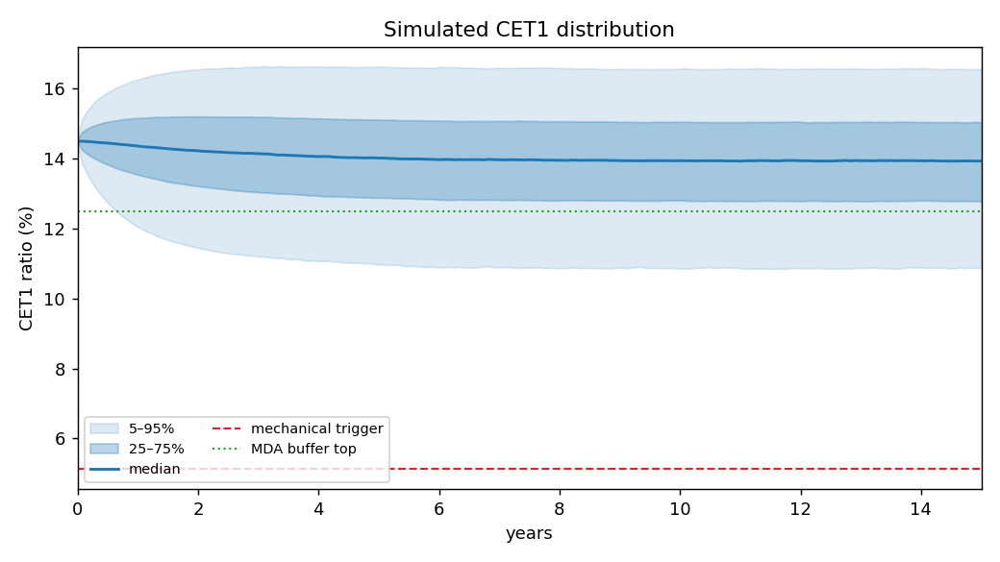
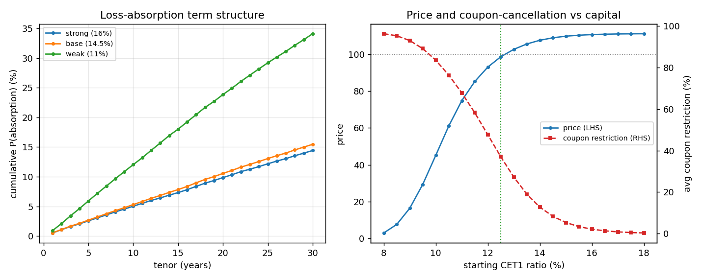

# at1-coco-pricer

Monte-Carlo valuation and risk for **AT1 contingent-convertible bonds** (CoCos),
priced as a *contingent claim on the issuer's CET1 capital ratio*.

Rather than bolt an equity-barrier onto a straight bond, this project takes the
capital ratio itself as the primitive state variable — because every AT1
cash-flow contingency is written on it. A single simulated CET1 path drives, at
once:

- **mechanical loss absorption** — CET1 crosses the contractual trigger (5.125% / 7%);
- **regulatory loss absorption** — a Point-of-Non-Viability (PONV) hazard;
- **coupon cancellation** — endogenous, through the CRD-IV Maximum Distributable
  Amount (MDA) buffer, so coupons are throttled by quartile as capital erodes;
- **extension / call risk** — the issuer calls at the first date on which
  refinancing is cheaper than the reset coupon, and refinancing gets *dearer as
  capital falls* — reproducing the empirical fact that weak issuers extend.

The result is a valuation in which price, coupon-cancellation probability, and
loss-absorption probability all move together off one economically meaningful
driver.

**Case study → [RESEARCH.md](RESEARCH.md):** the model calibrated to BNP Paribas's
three USD AT1s (Capital IQ prices, CET1 history, EBA stress test). It decomposes
the ~270bp spread (≈238bp PONV/tail premium, ≈22bp MDA coupon cuts, ≈4bp
conversion, 3–10bp extension), prices the first call as a 52–61% event, and shows
the capital cliff: ~0.5pt per point of CET1 today, ~4–5pt below the MDA threshold.
One implied PONV hazard (~2.3%/yr) prices all three bonds.

## Why this framing

An AT1 is not a bond with an option stapled on; it is a bundle of options the
regulator and issuer hold *against the investor*, all keyed to capital. Modelling
the CET1 ratio directly makes the three coupled risks — trigger, coupon, and
extension — consistent by construction, and makes the sensitivities
(Greeks) interpretable in the units a credit desk actually monitors: capital
levels, buffers, and hazards.

## Model

CET1 ratio `C_t` (percentage points) follows a mean-reverting jump-diffusion:

```
dC_t = kappa (theta − C_t) dt + sigma dW_t − J dN_t
```

with lognormal *downward* stress jumps `J` (rate `jump_intensity`) capturing the
fat left tail of capital erosion, and an independent PONV hazard. Coupons are
scaled by the MDA quartile schedule (0 / 20 / 40 / 60% inside the combined
buffer, 100% above it, 0% below the floor). See `paper/at1_coco_note.tex` for the
full write-up, including the risk-neutral / real-world calibration caveat and the
perpetual-tail treatment.

## Layout

```
at1-coco-pricer/
├── README.md
├── pyproject.toml
├── src/at1_coco/
│   ├── processes.py     ← CET1 jump-diffusion + trigger/PONV times
│   ├── instrument.py    ← AT1 term sheet + MDA schedule
│   ├── pricer.py        ← Monte-Carlo cash-flow engine
│   ├── risk.py          ← CRN Greeks, absorption term structure, loss dist.
│   └── market.py        ← dated bonds, stochastic refi spread, implied PONV
├── tests/               ← 24 tests (dynamics, MDA, pricing, risk signs, market)
├── scripts/
│   ├── price_example.py
│   ├── trigger_term_structure.py
│   ├── build_dataset.py     ← Capital IQ exports -> tidy CSVs
│   ├── market_analysis.py   ← capital and price analysis
│   ├── calibrate_bnp.py     ← implied PONV and cross-bond test
│   └── spread_and_stress.py ← spread decomposition, call odds, stress tests
├── data/                ← term sheets + public data (CIQ data kept local)
└── results/             ← generated figures
```

## Install & run

```bash
pip install -e .
pip install -e ".[dev]" && pytest      # run the test suite
python scripts/price_example.py         # valuation + Greeks + fan chart
python scripts/trigger_term_structure.py
```

## Quick start

```python
from at1_coco import AT1Note, CET1Params, MonteCarloPricer
from at1_coco.risk import greeks, loss_distribution

note = AT1Note(coupon_rate=0.06, first_call_year=5, trigger_level=5.125,
               mda_threshold=9.0, combined_buffer=3.5)
params = CET1Params(c0=14.5, kappa=0.40, theta=14.5, sigma=1.3,
                    jump_intensity=0.12, jump_median=2.2, jump_vol=0.5,
                    ponv_intensity=0.005)

pricer = MonteCarloPricer(note, params, discount_rate=0.03)
res = pricer.price(n_paths=80_000)
print(res.summary())
print(greeks(pricer))
print(loss_distribution(res))
```

## What the engine returns

`PricingResult` carries the price and its standard error plus path-level
diagnostics: `P(mechanical)`, `P(PONV)`, `P(called)`, `P(survived)`, the
coupon-leg PV, the average coupon restriction, and the expected time to
absorption. `risk.py` adds:

- **Greeks** by bump-and-reprice under **common random numbers** — the same
  random draws price base and bumped scenarios, so the sensitivity carries no
  Monte-Carlo noise of its own. Signs are asserted in the tests
  (`delta_cet1 > 0`, `jump/ponv/trigger/buffer < 0`, `dv01 < 0`).
- **`trigger_term_structure`** — cumulative absorption probability by tenor.
- **`loss_distribution`** — expected loss, VaR/ES, and P(loss) on the discounted
  payoff.

## Sample output (representative healthy issuer)

```
price                      109.07  (± 0.06)
P(absorption)               2.81%      P(called) 97.19%
avg coupon restriction      8.15%
```




## Validation

All estimator behaviour is pinned by tests rather than asserted in prose:
absorption rises with PONV intensity and falls with capital; the price falls for
weaker issuers, higher PONV, and higher triggers; probabilities partition to 1;
the CRN Greeks recover the expected signs; VaR/ES are coherent (`ES ≥ VaR`).

## Scope & honest limitations

- Equity **conversion** is currently captured through the `trigger_recovery`
  parameter (residual value delivered on absorption); a fully coupled equity
  process is a planned extension (see roadmap in the top-level README).
- Parameters are stated as **risk-neutral / pricing** measure. CET1 is not a
  traded asset, so calibration mixes market data (spreads, call behaviour) with
  a real-world capital view; the note discusses this identification gap.
- The perpetual tail beyond the 40y horizon is valued analytically as a
  perpetuity — immaterial once the horizon is long relative to the discount
  rate, but documented rather than hidden.

## License

MIT — see the repository `LICENSE`.
