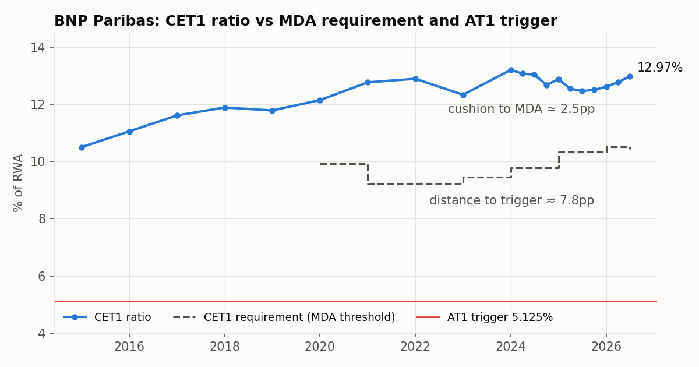
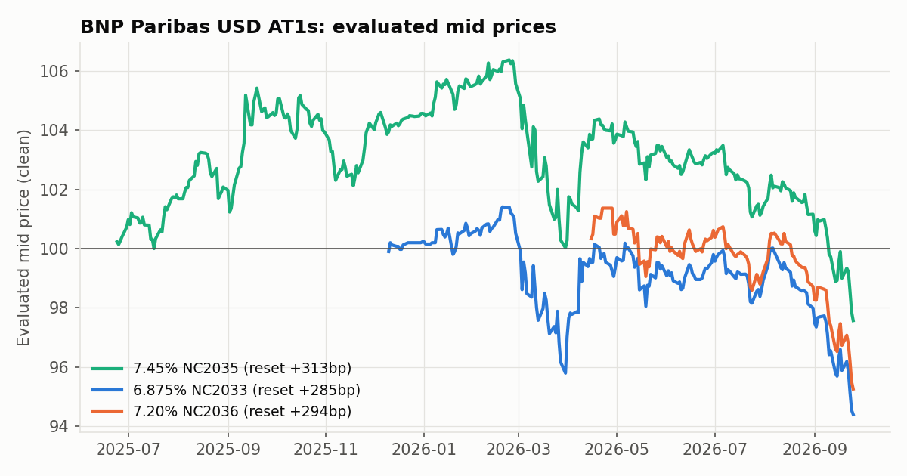
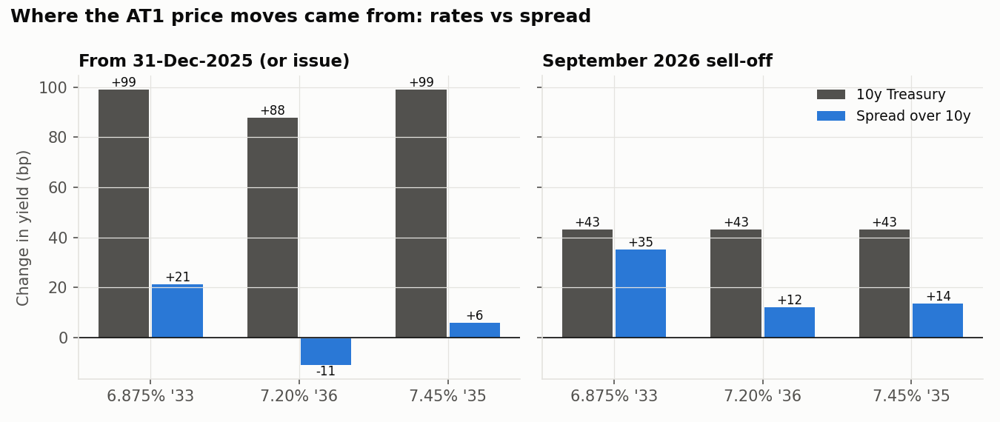

# Case study: BNP Paribas USD AT1s

*Data to 25 September 2026. Model: this repository's CET1-driven Monte Carlo,
extended for dated bonds in `src/at1_coco/market.py`.*

## Question

BNP Paribas has three USD AT1s outstanding with the same issuer, the same
5.125% group-CET1 trigger and the same conversion mechanism. They differ only in
coupon, first call and reset margin:

| ISIN | Coupon | First call / reset | Reset margin (5y CMT) | Mid price 25-Sep-26 | Yield to call |
|---|---|---|---|---|---|
| US05602XQR25 | 6.875% | 15-Dec-2033 | +285.3bp | 94.39 | 8.04% |
| US05602XQS08 | 7.20% | 17-Apr-2036 | +294.2bp | 95.25 | 7.92% |
| US05602XQQ42 | 7.45% | 27-Jun-2035 | +313.4bp | 97.57 | 7.84% |

Because capital risk is common to all three, a model that prices AT1s correctly
must fit all three with **one** set of issuer-risk parameters. Whatever it
cannot fit is either model error or relative value.

## Data

| What | Source | File |
|---|---|---|
| Term sheets | BNP Paribas pricing term sheets | `data/bonds_static.csv` |
| Evaluated bid/mid/ask, yield, spread to benchmark | S&P Capital IQ (evaluated pricing) | `data/bond_prices.csv` |
| CET1, Tier 1, RWA, leverage (quarterly 2024–26) | S&P Capital IQ (SNL) | `data/bnp_cet1_quarterly.csv` |
| CET1 and CET1 requirement stack (annual 2014–25) | S&P Capital IQ (SNL) | `data/bnp_capital_annual.csv` |
| BNP share price | S&P Capital IQ | `data/bnp_share.csv` |
| EBA 2025 stress test | EBA | `data/bnp_eba_stress_2025.csv` |

`scripts/build_dataset.py` rebuilds every tidy file from the raw exports.
Treasury yields are recovered from CIQ as `yield − spread to benchmark`.
The CIQ benchmark of the 6.875% changes twice in the sample (Jan and Aug 2026),
so the baseline uses one continuous series for all bonds: the ~10y benchmark of the 7.45%.

## 1. Capital: far from the trigger, closer to the MDA



- CET1 **12.97%** at 30-Jun-2026, against a CET1 requirement of **10.43%**
  (P1 4.5 + P2R 1.14 + buffers). The MDA cushion is **≈2.5pp, about €20bn** of
  CET1 on €795bn of RWA.
- The trigger is **7.8pp below**, about **€62bn** of losses. In the EBA 2025
  adverse scenario, CET1 fell by **4.2pp** (fully loaded, 12.87% → 8.66%).
- The CET1 cushion was **2.1pp at end-2025**, the thinnest in the 2019–2025 series. The
  requirement has risen by 1.3pp since 2020 (P2R, CCyB), and the O-SII buffer adds
  another 50bp in 2027–28.

**Historical dynamics.** Exact-OU maximum likelihood on 20 observations
(annual to 2023, quarterly after), with the long-run level fixed at the 13% management target:
κ ≈ 0.32/yr, **σ ≈ 0.41pp/√yr**. The package's illustrative default is
σ = 1.3, three times what BNP's history supports. The EBA stress fits the jump
component instead: with the default jump parameters, the 95th-percentile jump is
4.4pp, close to the EBA's 4.2pp depletion.

## 2. Prices: 2026 was a rates story, September was not




- Since end-2025 (since issue in April for the 7.20%), the bonds lost 5–7 points,
  and **Treasuries account for ~90–100bp of each bond's 77–120bp yield rise**. The 10y benchmark went from ~4.1% to ~5.2%.
- In the **September 2026 sell-off** (28-Aug → 25-Sep), Treasuries added +43bp to
  all three. Spreads rose **+35bp on the 6.875%** but only +12–14bp on the other two.
  The bond with the lowest reset margin, and so the most exposed to non-call,
  widened the most. That is what extension risk looks like. The BNP share fell 4%
  over the same window.

## 3. Calibration and the cross-sectional test

**Set-up** (`scripts/calibrate_bnp.py`, weekly, 66 dates):

- CET1 follows the historical OU above plus stress jumps. CET1 is observed with
  a 35-day publication lag.
- The new-issue AT1 spread is an **OU process** (κ = 0.5, long-run = sample mean
  270bp over the 10y), correlated −0.3 with CET1 shocks. It also widens by 1% per
  pp of CET1 inside the buffer.
- The issuer **calls on a reset date** when its reset margin exceeds the new-issue
  spread and CET1 is above the MDA threshold.
- At the trigger the notes **convert** at the floor price. Recovery is
  `min(1, S_trigger/floor)`, with the share assumed to fall to 20% of today's price
  (≈31–37% recovery).
- **PONV** is a constant hazard λ, priced *analytically* (conditional Monte
  Carlo). This makes the price smooth and monotone in λ, so λ is solved exactly on
  one set of 20,000 paths.

**Results, 25 September 2026 (100bp spread vol):**

| | 6.875% NC33 | 7.20% NC36 | 7.45% NC35 |
|---|---|---|---|
| Model clean price with **no** PONV risk | 114.1 | 117.5 | 117.8 |
| **Implied PONV hazard** | **2.36%/yr** | **2.37%/yr** | **2.34%/yr** |
| P(called at first reset) | 52% | 55% | 61% |
| Lifetime P(mechanical conversion) | 1.4% | 1.6% | 1.4% |

1. **Historical capital risk explains almost none of the spread.** With CET1
   dynamics taken from BNP's own history, the bonds would trade at 114–118.
   The market prices them at 94–98. Closing that gap takes a PONV / tail hazard of
   ~2.35% a year. In other words, the ~270bp AT1 spread is almost entirely
   compensation for regulatory write-down, tail and liquidity risk, not for the
   mechanical trigger. This matches the Credit Suisse 2023 lesson.
2. **One hazard fits all three bonds.** The three implied hazards agree within
   **3bp of hazard**, i.e. within ~0.1 price points. Over all 66 weeks the mean
   cross-bond dispersion is 6bp with a stochastic refinancing spread, against 9bp with the
   package's deterministic rule. Across the sample, the three bonds' pricing errors
   under a common hazard average between −0.2 and +0.6 points.
3. **Extension risk needs a stochastic spread.** With a deterministic
   refinancing spread, the low-margin 6.875% is either always or never called, and
   the fit gets worse. Making the new-issue spread random improves the fit at every
   volatility tested. However, the cross-section flattens out rather than
   pinning the volatility down, so 100bp is an assumption, not an estimate.
4. **Implied hazard over time.** It ranged from 2.0% to 2.7%. It peaked in
   March 2026, when both bonds then outstanding fell 4–5 points, and rose again
   into the September sell-off.


### What would change the conclusions (most important first)

1. **The Treasury curve.** Discounting the 6.875% on its own (7y) CIQ benchmark
   instead of the common 10y series widens the cross-bond dispersion from 3bp to
   10bp and makes the 6.875% look 0.4–1.3pt cheap. The curve choice matters more
   than any model parameter. The next step is the FRED curve (DGS5 for the actual
   CMT reset, DGS7/DGS10 for discounting).
2. **Evaluated, not traded, prices.** CIQ evaluations can lag in fast markets.
3. **Stationary rates.** The reset rate is today's Treasury yield held flat.
   A rate model (e.g. Hull-White) would add rate-driven extension value.
4. **Short spread sample.** 15 months of tight spreads (238–323bp) in a benign
   regime. The long-run spread level and its volatility are assumptions.
5. **Conversion value.** The share price at the trigger is a single stress
   factor, not a joint equity-CET1 process.

## Reproduce

```bash
pip install -e ".[dev]" scipy
python scripts/build_dataset.py      # raw CIQ exports -> tidy CSVs
python scripts/market_analysis.py    # section 1-2 figures and numbers
python scripts/calibrate_bnp.py      # section 3 (~5 min)
pytest                               # 23 tests incl. accrued vs CIQ, call dates, repricing
```
