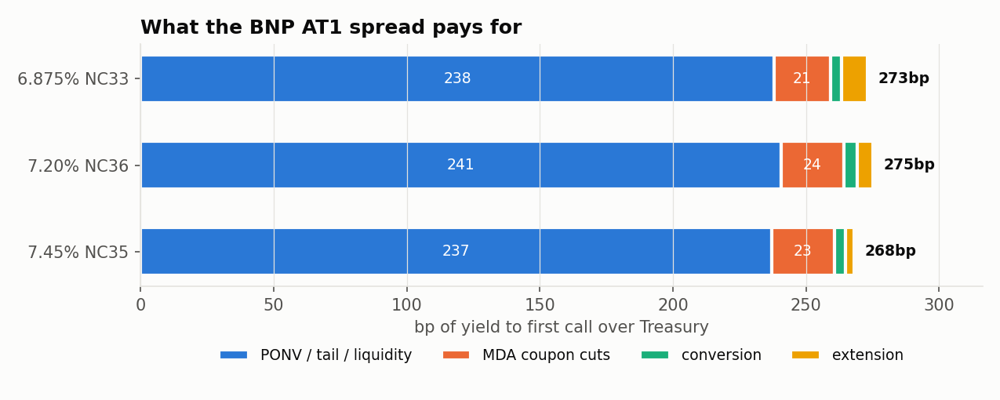
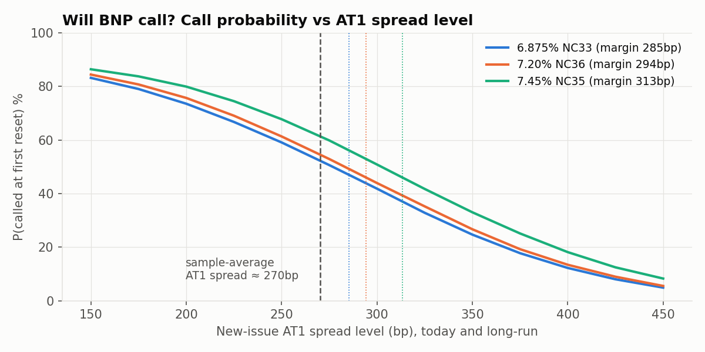
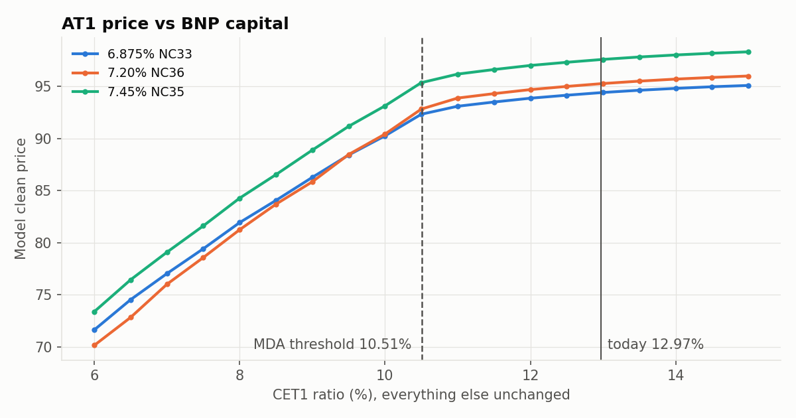
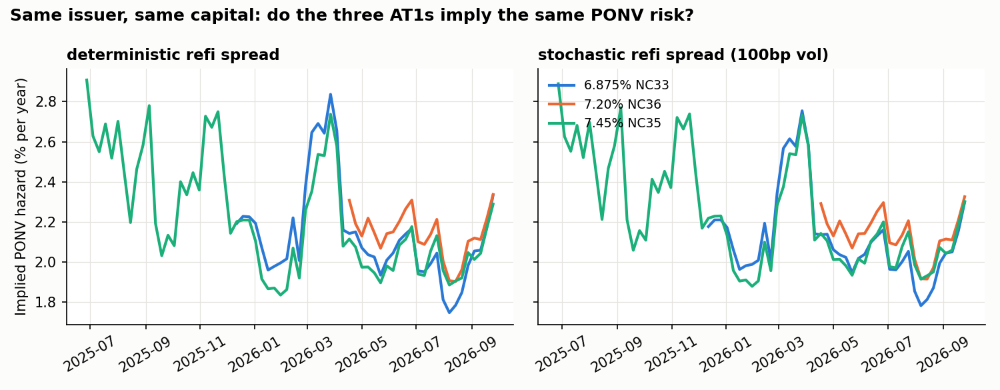

# BNP Paribas USD AT1s: what the spread pays for, will they be called, what can you lose

*Data to 25 September 2026. Model: this repository's CET1-driven Monte Carlo,
extended for real bonds in `src/at1_coco/market.py`.*

## The three bonds

Same issuer, same 5.125% group-CET1 trigger, same conversion into shares.
They differ only in coupon, first call and reset margin:

| | 6.875% NC33 | 7.20% NC36 | 7.45% NC35 |
|---|---|---|---|
| ISIN | US05602XQR25 | US05602XQS08 | US05602XQQ42 |
| First call = first reset | 15-Dec-2033 | 17-Apr-2036 | 27-Jun-2035 |
| Reset margin over 5y CMT | 285bp | 294bp | 313bp |
| Mid price, 25-Sep-2026 | 94.39 | 95.25 | 97.57 |
| Yield-to-call spread over Treasury | 273bp | 275bp | 268bp |

## Key findings

1. **Almost all of the spread pays for regulatory write-down and tail risk, not for the trigger.**
   Of the ~270bp, about **238bp** is PONV / tail / liquidity premium, **21–24bp** is
   expected MDA coupon cuts, **4–5bp** is mechanical conversion, and **3–10bp** is
   extension risk. With BNP's own capital history and no PONV risk, the bonds would be
   worth 114–118, against a market price of 94–98.
2. **The first call is a coin flip, and the 6.875% carries the most extension risk.**
   The model gives a **52% / 55% / 61%** probability of a call at the first reset.
   The 6.875%'s reset margin is only ~8bp above today's AT1 spread. If AT1 spreads
   settle 50bp wider, it loses **1.0pt more than if the call were certain**, against
   0.6pt for the 7.45%. The market behaved exactly like this in September 2026: the
   6.875% widened +35bp, the other two +12–14bp.
3. **Capital risk is a cliff, not a slope.** At today's 13% CET1 the price moves only
   **~0.5pt per point of CET1**. Below the MDA threshold (10.5%) the sensitivity jumps to
   **~4–5pt per point**. A 2pp capital loss costs ~1.4pt. The EBA adverse depletion
   (−4.2pp) costs **~10pt**, and **~25pt** if spreads also widen 200bp.
4. **One set of issuer-risk parameters prices all three bonds.** The implied PONV
   hazards agree within 3bp on the last date. The cross-section pins down the
   refinancing-spread volatility at ~75–100bp: too little or too much makes the
   three bonds inconsistent.

## 1. What the spread pays for



Features are switched on one at a time. Each intermediate price is converted into a
yield-to-first-call spread over the Treasury, so the components **add up exactly to
the market spread**:

| bp of yield-to-call spread | 6.875% NC33 | 7.20% NC36 | 7.45% NC35 |
|---|---|---|---|
| PONV / tail / liquidity premium | 238 | 241 | 237 |
| MDA coupon cuts | 21 | 24 | 24 |
| Mechanical conversion at 5.125% | 4 | 5 | 4 |
| Extension (issuer's call option) | 10 | 6 | 3 |
| **Total = market** | **273** | **275** | **268** |

The order is: premium first (so every later feature is valued with risky
discounting), extension last (valued with every other feature in place).
The extension cost falls with the reset margin, as it should.

**How to read the premium.** BNP's CET1 has a historical volatility of 0.41pp/√yr
and sits 7.8pp (about €62bn of losses) above the trigger. Mechanical conversion is
therefore a 1.4–1.6% lifetime event worth only ~4bp. The market charges ~240bp for
something else: the resolution authority acting before the trigger, tail events
beyond the historical sample, and liquidity. That is the Credit Suisse 2023 lesson,
expressed as a number.

## 2. Will BNP call?



- The issuer calls on a reset date when its reset margin is above the new-issue AT1
  spread and CET1 is above the MDA threshold. The new-issue spread is simulated
  (mean-reverting, 100bp vol, correlated with capital shocks), so the call is a
  probability, not a certainty:

| | 6.875% NC33 | 7.20% NC36 | 7.45% NC35 |
|---|---|---|---|
| Reset margin − today's AT1 spread | +8bp | +17bp | +36bp |
| P(called at first reset) | 52% | 55% | 61% |
| P(called at some reset) | 98% | 98% | 98% |
| Cost of the issuer's option (pts) | 0.51 | 0.38 | 0.20 |
| P&L if AT1 spreads settle +50bp | −3.3 | −3.6 | −3.2 |
| … of which extra loss from extension | −1.0 | −0.8 | −0.6 |

- The curve shows the whole trade-off. At a 200bp AT1 spread all three are called
  about three times out of four. At 350bp only a quarter to a third are. The
  6.875% is always the least likely to be called.
- **Negative convexity.** Wider spreads hurt twice: through discounting, and by
  making extension more likely. This effect is largest for the low-margin bond,
  and it is visible in the data: in the September 2026 sell-off the 6.875%'s
  spread rose almost three times as much as its siblings'.

## 3. What can you lose?



Each scenario reprices all three bonds with the same random numbers. The PONV
hazard moves with spreads, and with capital once CET1 falls inside the buffer.

| Clean price change (pts) | 6.875% NC33 | 7.20% NC36 | 7.45% NC35 |
|---|---|---|---|
| Rates +100bp | −5.2 | −6.3 | −6.1 |
| Rates −100bp | +5.6 | +6.9 | +6.6 |
| CET1 −2pp (capital only) | −1.3 | −1.4 | −1.4 |
| CET1 −4.2pp = EBA adverse (capital only) | −9.2 | −10.4 | −9.8 |
| AT1 spreads +200bp | −16.5 | −16.7 | −15.7 |
| March-2023 style: spreads +200bp, rates −50bp | −14.6 | −14.3 | −13.3 |
| EBA adverse + spreads +200bp | −24.9 | −26.2 | −24.8 |
| PONV scare (hazard ×3) | −26.3 | −28.9 | −27.6 |

**Capital delta** (price points per +1pp of CET1):

| CET1 level | 13% (today) | 12% | 11% | 10.5% (MDA) | 9% | 7% |
|---|---|---|---|---|---|---|
| 6.875% NC33 | 0.5 | 0.7 | 1.5 | 4.2 | 4.4 | 5.0 |
| 7.45% NC35 | 0.6 | 0.8 | 1.6 | 4.5 | 4.7 | 5.3 |

Crossing the MDA threshold does three things at once: coupons are cut, the issuer
cannot call, and the hazard rises. BNP's CET1 cushion was 2.5pp at June 2026 and
only 2.1pp at end-2025. So a capital hit about half the size of the EBA adverse
scenario is enough to move these bonds from the flat part of the curve onto the
cliff. For a portfolio, **the relevant risk number is the distance to the MDA
threshold, not the distance to the trigger.**

## 4. Does the model hold up?



- **Cross-section.** On 25-Sep-2026 the implied hazards are 2.30% / 2.33% / 2.30%
  a year. Their spread across the three bonds is U-shaped in the refinancing-spread
  volatility: 4.8bp at 0 vol, **2.7bp at 75–100bp**, 4.0bp at 200bp. The three
  bonds therefore *identify* the volatility that the issuer's option is priced with.
- **Time series (66 weeks).** The mean cross-bond gap falls from 8.2bp
  (deterministic rule of the base package) to 6.0bp (stochastic spread). Pricing
  every bond at the day's common hazard, the 6.875% and 7.45% are within ±0.1pt on
  average. The **7.20% has traded ~0.6pt cheap to its siblings since issue**
  (0.1–1.1pt, 0.1pt now), consistent with new-issue concession.
- **Implied hazard over time** ranged from 1.8% to 2.9% (the high is the 7.45%'s
  issue week). Apart from that it peaked in March 2026 (~2.75%), when the bonds then
  outstanding fell 4–5 points, and rose again into the September sell-off.

## Data

| What | Source | File |
|---|---|---|
| Term sheets | BNP Paribas pricing term sheets | `data/bonds_static.csv` |
| Evaluated bid/mid/ask, yield, spread to benchmark | S&P Capital IQ | `data/bond_prices.csv` |
| CET1, Tier 1, RWA, leverage (quarterly 2024–26) | S&P Capital IQ (SNL) | `data/bnp_cet1_quarterly.csv` |
| CET1 and requirement stack (annual 2014–25) | S&P Capital IQ (SNL) | `data/bnp_capital_annual.csv` |
| BNP share price | S&P Capital IQ | `data/bnp_share.csv` |
| EBA 2025 stress test | EBA | `data/bnp_eba_stress_2025.csv` |

Capital IQ data is licensed and kept out of the public repository (`.gitignore`);
`scripts/build_dataset.py` rebuilds the tidy files from the raw exports.

## Model and calibration

- **CET1**: mean-reverting jump-diffusion. Exact-OU maximum likelihood on 20
  observations (annual to 2023, quarterly after), long-run level fixed at the 13%
  management target: κ = 0.32, **σ = 0.41pp/√yr**, a third of the package's
  illustrative default. Stress jumps (rate 0.12/yr, median 2.2pp): their
  95th-percentile size, 4.4pp, matches the EBA adverse depletion of 4.2pp.
  CET1 is observed with a 35-day publication lag.
- **MDA geometry** from the 2025 requirement stack: floor 5.64% (P1 + P2R),
  combined buffer 4.87% (threshold 10.51%).
- **New-issue AT1 spread**: OU, mean reversion 0.5, long-run = sample mean (270bp over the 10y),
  100bp vol, correlation −0.3 with CET1 shocks, plus 1% per pp of CET1 inside the buffer.
- **Call**: on reset dates only, when the reset margin exceeds the new-issue spread
  and CET1 is above the MDA threshold.
- **Conversion**: at max(market price, floor). Recovery = min(1, stressed share / floor),
  with the share assumed to fall to 20% of today's price (≈31–37%).
- **PONV**: hazard λ·s_t/s_0, proportional to the simulated issuer spread. It is
  priced analytically on each path (conditional Monte Carlo), so the price is smooth
  in λ and the implied hazard is solved exactly on one set of 20,000 paths.
- **Rates**: one continuous ~10y Treasury series (from CIQ benchmark spreads) for
  discounting and as the reset reference.

## Limits, most important first

1. **Treasury curve.** Discounting the 6.875% on its own 7y benchmark instead of the
   common 10y series raises the last-date dispersion from 2.7bp to 8bp. The curve
   matters more than any model parameter. The next step is the FRED curve (DGS5 for the
   actual reset, DGS7/DGS10 for discounting).
2. **Capital add-on** (1% of spread per pp of CET1 inside the buffer) drives the
   size of the cliff. It is an assumption; a cross-bank regression of AT1 spreads on
   MDA distance would calibrate it.
3. **Evaluated, not traded, prices**; a 15-month sample of tight spreads (238–323bp).
4. **Flat rates**: no rate model, so rate-driven extension is missing.
5. **PONV recovery = 0** and conversion value from a single stressed share price.

## Reproduce

```bash
pip install -e ".[dev]" scipy
python scripts/build_dataset.py      # raw CIQ exports -> tidy CSVs
python scripts/market_analysis.py    # capital and price history figures
python scripts/calibrate_bnp.py      # implied PONV, cross-bond test (~15 min)
python scripts/spread_and_stress.py  # decomposition, call analysis, stress (~4 min)
pytest                               # 24 tests
```

Earlier descriptive figures: [CET1 history](results/bnp_cet1_history.png),
[prices](results/bnp_at1_prices.png), [rates vs spread split](results/bnp_at1_yield_split.png).
