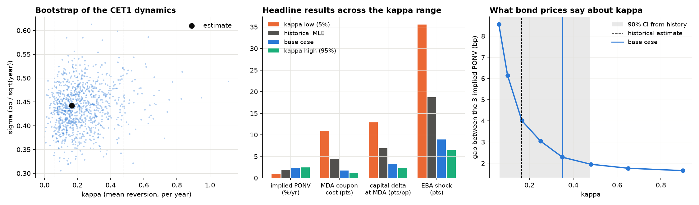
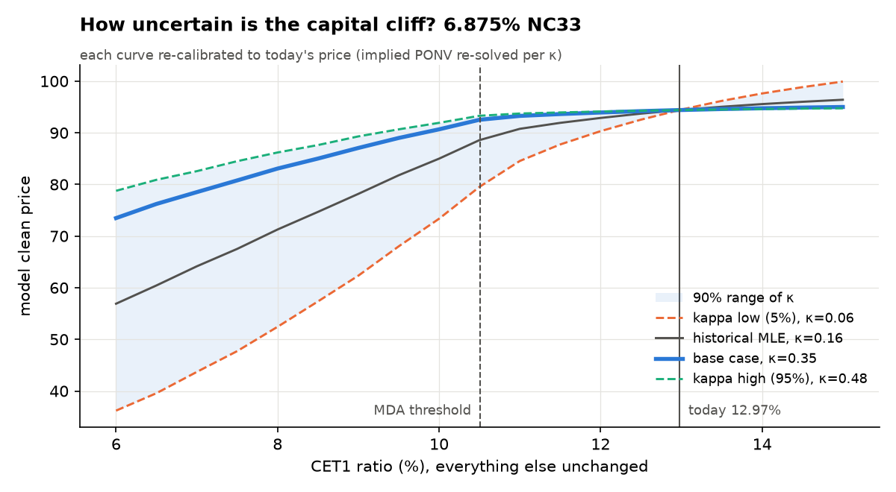

# BNP Paribas USD AT1s: what the spread pays for, will they be called, what can you lose

*Data to 25 September 2026. Model: this repository's CET1-driven Monte Carlo,
extended for real bonds in `src/at1_coco/market.py`. Academic project, not
investment advice.*

## The three bonds

Same issuer, same 5.125% group-CET1 trigger, same conversion into shares.
They differ only in coupon, first call and reset margin:

| | 6.875% NC33 | 7.20% NC36 | 7.45% NC35 |
|---|---|---|---|
| ISIN | US05602XQR25 | US05602XQS08 | US05602XQQ42 |
| First call = first reset | 15-Dec-2033 | 17-Apr-2036 | 27-Jun-2035 |
| Reset margin over 5y CMT | 285bp | 294bp | 313bp |
| Mid price, 25-Sep-2026 | 94.39 | 95.25 | 97.57 |
| Yield-to-call spread over the call-matched Treasury | 279bp | 274bp | 269bp |

## Key findings

1. **Almost all of the spread pays for regulatory write-down and tail risk, not for the trigger.**
   Of the ~270–280bp, about **240bp** is PONV / tail / liquidity premium, **20–22bp**
   expected MDA coupon cuts, **4–5bp** mechanical conversion and **4–12bp** extension
   risk. With BNP's capital dynamics and no PONV risk, the bonds would be worth
   115–118, against a market price of 94–98.
2. **The first call is a coin flip, and the 6.875% carries the most extension risk.**
   The model gives a **51% / 53% / 60%** probability of a call at the first reset.
   The 6.875%'s reset margin is only ~6bp above today's AT1 spread. If AT1 spreads
   settle 50bp wider, it loses **1.2pt more than if the call were certain**, against
   0.7pt for the 7.45%. The market behaved like this in the four weeks to 25 September
   2026: with the 10y Treasury up 45bp, the 6.875%'s spread widened a further
   +34bp, the other two only +10–12bp.
3. **Capital risk is a cliff, not a slope.** At today's 13% CET1 the price moves only
   **~0.45pt per point of CET1**; around the MDA threshold (10.5%) the sensitivity is
   **~4pt per point**. The EBA adverse depletion (−4.2pp) costs **~9pt**, and **~25pt**
   if spreads also widen 200bp.
4. **The weakest input is how fast BNP rebuilds capital, and bond prices help pin it down.**
   History alone puts the half-life of a capital shock anywhere between 1.5 and 11
   years, and the stress results change by a factor of 6 across that range. The three
   bond prices are only mutually consistent with the faster end. The base case
   (κ = 0.35, half-life 2 years) is the value both sources can live with.
5. **One set of issuer-risk parameters prices all three bonds.** The implied PONV
   hazards (2.33% / 2.31% / 2.31%) agree within 2.3bp on the last date.

## 1. What the spread pays for


Features are switched on one at a time. Each intermediate price is converted into a
yield-to-first-call spread over the Treasury used for discounting, so the components
**add up exactly to the market spread**:

| bp of yield-to-call spread | 6.875% NC33 | 7.20% NC36 | 7.45% NC35 |
|---|---|---|---|
| PONV / tail / liquidity premium | 243 | 240 | 239 |
| MDA coupon cuts | 20 | 22 | 22 |
| Mechanical conversion at 5.125% | 4 | 5 | 4 |
| Extension (issuer's call option) | 12 | 7 | 4 |
| **Total = market** | **279** | **274** | **269** |

The order is: premium first (so every later feature is valued with risky
discounting), extension last (valued with every other feature in place). The
extension cost falls with the reset margin, as it should.

**How to read the premium.** BNP's CET1 sits 7.8pp (about €62bn of losses) above the
trigger. With its historical volatility, mechanical conversion is a ~1.3–1.5% lifetime
event worth only ~4bp. The market charges ~240bp for something else: the resolution
authority acting before the trigger, tail events beyond the historical sample, and
liquidity. That is the Credit Suisse 2023 lesson, expressed as a number.
*Caveat:* the split between the premium and the MDA component depends on how fast
capital mean-reverts (section 5); the total does not.

## 2. Will BNP call?


The issuer calls on a reset date when its reset margin is above the new-issue AT1
spread and CET1 is above the MDA threshold. The new-issue spread is simulated
(mean-reverting, 100bp vol, correlated with capital shocks), so the call is a
probability, not a certainty:

| | 6.875% NC33 | 7.20% NC36 | 7.45% NC35 |
|---|---|---|---|
| Reset margin − today's AT1 spread | +6bp | +15bp | +34bp |
| P(called at first reset) | 51% | 53% | 60% |
| P(called at some reset) | 98% | 98% | 98% |
| Cost of the issuer's option (pts) | 0.63 | 0.47 | 0.26 |
| P&L if AT1 spreads settle +50bp | −3.4 | −3.6 | −3.3 |
| … of which extra loss from extension | −1.2 | −0.9 | −0.7 |

- At a 200bp AT1 spread all three are called about three times out of four; at
  350bp only a quarter to a third are. The 6.875% is always the least likely to be called.
- **Negative convexity.** Wider spreads hurt twice: through discounting, and by
  making extension more likely. The effect is largest for the low-margin bond, and
  it shows in the data: in the September 2026 sell-off the 6.875%'s spread rose
  almost three times as much as its siblings'.

## 3. What can you lose?


Each scenario reprices all three bonds on the same random numbers. The PONV hazard
moves with spreads, and with capital once CET1 falls inside the buffer.

| Clean price change (pts) | 6.875% NC33 | 7.20% NC36 | 7.45% NC35 |
|---|---|---|---|
| Rates +100bp | −5.2 | −6.3 | −6.1 |
| Rates −100bp | +5.6 | +6.9 | +6.6 |
| CET1 −2pp (capital only) | −1.2 | −1.2 | −1.2 |
| CET1 −4.2pp = EBA adverse (capital only) | −8.3 | −9.5 | −8.9 |
| AT1 spreads +200bp | −16.9 | −16.8 | −16.0 |
| March-2023 style: spreads +200bp, rates −50bp | −15.1 | −14.4 | −13.7 |
| EBA adverse + spreads +200bp | −24.6 | −25.6 | −24.2 |
| PONV scare (hazard ×3) | −26.8 | −29.0 | −27.9 |

**Capital delta** (price points per +1pp of CET1):

| CET1 level | 13% (today) | 12% | 11% | 10.5% (MDA) | 9% | 7% |
|---|---|---|---|---|---|---|
| 6.875% NC33 | 0.4 | 0.6 | 1.5 | 3.7 | 4.1 | 4.6 |
| 7.45% NC35 | 0.5 | 0.6 | 1.6 | 4.0 | 4.4 | 4.8 |

Crossing the MDA threshold does three things at once: coupons are cut, the issuer
cannot call, and the hazard rises. BNP's CET1 cushion was 2.5pp at June 2026 and
only 2.1pp at end-2025, so a capital hit about half the size of the EBA adverse
scenario moves these bonds from the flat part of the curve onto the cliff. For a
portfolio, **the relevant risk number is the distance to the MDA threshold, not the
distance to the trigger.**

## 4. Does the model hold up?


- **Cross-section.** On 25-Sep-2026 the implied hazards are 2.33% / 2.31% / 2.31% a
  year, 2.3bp apart. With a deterministic refinancing spread (the base package's
  rule) they are 8.3bp apart.
- **Time series (66 weeks).** The mean cross-bond gap is 6.0bp with a stochastic
  refinancing spread against 9.6bp with the deterministic rule. Priced at the day's
  common hazard, each bond's average error is within ±0.25pt (range −1.1 to +1.0).
- **Implied hazard over time** ranged from 1.9% (August 2026) to 2.8% (late March
  2026, when the bonds then outstanding fell 4–5 points), and rose again into the
  September sell-off.
- **Rates.** With the FRED curve (5y CMT for the reset, call-matched yield for
  discounting) the bonds are more consistent than with Capital IQ benchmark proxies
  (2.3bp against 2.7–7.6bp on the last date).

## 5. How much can we trust the capital parameters?



**Bootstrap.** 1,000 CET1 histories simulated on the observed quarterly dates with
the fitted dynamics, each re-estimated:

| | Estimate | 90% interval |
|---|---|---|
| κ (mean reversion, /yr) | 0.165 | 0.06 – 0.48 |
| σ (pp/√yr) | 0.44 | 0.37 – 0.52 |
| Half-life of a capital shock | 4.2 years | 1.5 – 11 years |

Volatility is well estimated; the speed at which BNP rebuilds capital is not.

**It matters** (averages of the three bonds):

| | κ = 0.06 (5%) | κ = 0.165 (history) | **κ = 0.35 (base)** | κ = 0.48 (95%) |
|---|---|---|---|---|
| Implied PONV (%/yr) | 0.9 | 1.9 | **2.3** | 2.4 |
| MDA coupon cost (pts) | 10.9 | 4.4 | **1.7** | 1.2 |
| Capital delta at the MDA threshold (pts/pp) | 12.9 | 7.0 | **3.3** | 2.3 |
| EBA adverse shock (pts) | −35.6 | −18.7 | **−8.9** | −6.4 |

**What bond prices say.** The three bonds must imply the same PONV hazard. Their gap
falls from 8.6bp at κ = 0.06 to 4.0bp at the historical estimate, 2.3bp at 0.35 and
1.9bp at 0.48, then flattens. Bond prices are consistent only with fairly fast capital
rebuilding, in the upper part of the historical interval, which fits BNP's active
capital management (13% target, RWA and distribution policy). The history, however,
rejects values much above 0.35 (its log-likelihood drops by 1.5 at 0.35 and by 4.1 at
0.48). **κ = 0.35 is the base case**: inside the historical interval and close to the
market plateau.

**Where the uncertainty sits.** Each curve below is re-calibrated to today's price of
the 6.875%, so all four agree at today's 13% CET1 (94.4). They diverge only once
capital falls: at the MDA threshold (10.5%) the price ranges from 80 (κ = 0.06) to 93
(κ = 0.48), and at 6% CET1 from 36 to 79. The market pins down today's price, not the
shape of the cliff.



What is robust across the whole range: the ordering of the three bonds, the
extension ranking, and the fact that the price sensitivity to capital is several
times larger near the MDA threshold than today. The *level* of the capital stress and
the premium-vs-MDA split are not robust, and are reported with this range.

## Data

| What | Source | File |
|---|---|---|
| Term sheets | BNP Paribas pricing term sheets | `data/bonds_static.csv` |
| Evaluated bid/mid/ask, yield, spread to benchmark | S&P Capital IQ | `data/bond_prices.csv` |
| CET1, Tier 1, RWA, leverage, quarterly 2008–2026 | S&P Capital IQ (SNL) | `data/bnp_cet1_quarterly.csv` |
| CET1 requirement stack, annual 2019–2025 | S&P Capital IQ (SNL) | `data/bnp_capital_annual.csv` |
| BNP share price | S&P Capital IQ | `data/bnp_share.csv` |
| Treasury CMT 5y / 7y / 10y | FRED (DGS5, DGS7, DGS10) | `data/fred_treasury.csv` |
| EBA 2025 stress test | EBA | `data/bnp_eba_stress_2025.csv` |

Capital IQ data is licensed and kept out of the public repository (`.gitignore`);
`scripts/build_dataset.py` rebuilds the tidy files from the raw exports.

## Model and calibration

- **CET1**: mean-reverting jump-diffusion, long-run level at the 13% management
  target. History: exact-OU maximum likelihood on 50 quarters (2014Q1–2026Q2, Basel
  III only), excluding the 2023Q1 jump from the Bank of the West sale:
  κ = 0.165, σ = 0.44. Base case κ = 0.35 with σ = 0.47 re-estimated given κ
  (section 5). Stress jumps (rate 0.12/yr, median 2.2pp): their 95th-percentile size,
  4.4pp, matches the EBA adverse depletion of 4.2pp. CET1 is observed with a 35-day
  publication lag.
- **MDA geometry** from the 2025 requirement stack: floor 5.64% (P1 + P2R), combined
  buffer 4.87% (threshold 10.51%).
- **New-issue AT1 spread**: OU, mean reversion 0.5, long-run = sample mean (275bp),
  100bp vol, correlation −0.3 with CET1 shocks, plus 1% per pp of CET1 inside the
  buffer. The cross-bond gap keeps shrinking as this vol rises (8.3bp at 0, 2.3bp at
  100bp, 1.0bp at 200bp), so the data do not pin it down; 100bp is an assumption.
- **Call**: on reset dates only, when the reset margin exceeds the new-issue spread
  and CET1 is above the MDA threshold.
- **Conversion**: at max(market price, floor). Recovery = min(1, stressed share /
  floor), with the share assumed to fall to 20% of today's price (≈31–37%).
- **PONV**: hazard λ·s_t/s_0, proportional to the simulated issuer spread, priced
  analytically on each path (conditional Monte Carlo), so the implied hazard is solved
  exactly on one set of 20,000 paths.
- **Rates**: FRED constant-maturity Treasuries. The 5y CMT is the reset reference;
  each bond is discounted at the yield interpolated at its first call.

## Limits, most important first

1. **Capital mean reversion (κ)** is weakly identified by history and drives the
   capital stress results (section 5). The base case combines history and prices.
2. **Capital add-on** (1% of spread per pp of CET1 inside the buffer) also drives the
   size of the cliff. It is an assumption; a cross-bank regression of AT1 spreads on
   MDA distance would calibrate it.
3. **Spread volatility** (100bp) is not pinned down by the cross-section.
4. **Evaluated, not traded, prices**; a 15-month sample of tight spreads.
5. **Rates are not stochastic**: today's curve is used for all future resets.
6. **PONV recovery = 0**, and conversion value comes from a single stressed share price.

## Reproduce

```bash
pip install -e ".[dev]"
bash run_all.sh            # everything: data, tests, figures, video, PDF (~25 min)
bash run_all.sh --quick    # same, without the weekly calibration (~15 min)
```

`run_all.sh` runs, in order: `build_dataset.py` (raw CIQ exports -> tidy CSVs),
`pytest` (24 tests), `market_analysis.py`, `calibrate_bnp.py`, `spread_and_stress.py`,
`parameter_uncertainty.py`, `make_video.py` and `latexmk` on the paper. All
figures read their dates, levels and annotations from the data, so dropping in
newer exports (CIQ, `data/fred_treasury.csv`, `data/bnp_srep_requirement.csv`)
and rerunning updates every chart and caption. Logs go to `results/*_log.txt`.

Descriptive figures: [CET1 history and 5-year outlook](results/bnp_cet1_history.png),
[prices](results/bnp_at1_prices.png), [rates vs spread split](results/bnp_at1_yield_split.png).
