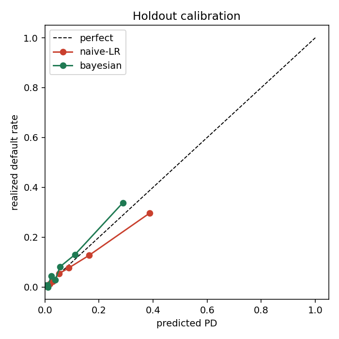

# Bayesian Credit Updating

**Conditional credit pricing is Bayesian updating.** A bond or CDS spread encodes a
*prior* default probability; new signals (a downgrade, an earnings miss, a spread
move) are *evidence*; the fair default probability is the *posterior*. This repo
implements that view end to end — and shows the trap that catches most naive
implementations: **credit signals are correlated, so multiplying their likelihood
ratios as if they were independent overstates risk.**

<p align="center"></p>

## The idea in one line

```
posterior_odds  =  prior_odds  ×  ∏_j  LR_j          (independent signals)
```

with `prior_odds` read off the spread via the credit triangle
(`λ = spread/(1−R)`, `PD = 1 − e^{−λT}`) and each `LR_j = P(signal | default) /
P(signal | survive)` estimated from history. The catch: the product form is exact
only under conditional independence. When a downgrade and an earnings miss are both
driven by the same deterioration, the product double-counts it.

## What the demo shows (synthetic data, fully reproducible)

```
LR[downgrade]        = 2.12
LR[earnings_miss]    = 1.96
LR[spread_widening]  = 2.04
joint LR (all three) = 3.54        ← the signals are redundant …
product of marginals = 8.50        ← … but independence assumes they aren't

a name with all three signals, 2% prior:
  naive (independent) posterior PD = 14.8%
  joint (correlation-aware)    PD  =  6.7%      (naive overstates by 8 pts)

holdout calibration (AUC ↑, Brier ↓, LogLoss ↓):
  prior-only   AUC=0.767  Brier=0.0657  LogLoss=0.2458
  naive-LR     AUC=0.837  Brier=0.0591  LogLoss=0.2100
  bayesian     AUC=0.842  Brier=0.0575  LogLoss=0.2056
```

A single population-wide joint LR is not the fix either: with **rating** as a
confounder it *understates*. Only the hierarchical Bayesian model — which conditions
on rating *and* treats the signals jointly — is well calibrated out of sample.

## Method

1. **Prior from the market** (`bcu.priors`). Credit-triangle map from spread to a
   prior default probability, plus probability↔odds helpers.
2. **Likelihood ratios from history** (`bcu.likelihood`). Marginal and *joint* LRs
   with Laplace smoothing; the joint LR is the correlation-aware object.
3. **Updating** (`bcu.updating`). Odds-form update; `naive_update` (independent) vs
   `joint_update` (correlation-aware).
4. **Hierarchical Bayesian model** (`bcu.bayesian_model`, PyMC).
   `logit p_i = a_{rating(i)} + Σ_k β_k · signal_{ik}`, with partial pooling across
   ratings. Each `exp(β_k)` is a rating- and co-signal-adjusted odds multiplier.
5. **Backtest** (`bcu.backtest`). AUC, Brier, log loss, and calibration tables.

## Install

```bash
git clone https://github.com/<you>/bayesian-credit-updating.git
cd bayesian-credit-updating
pip install -e ".[bayes,dev]"      # core deps + PyMC + pytest
```

Core modules need only numpy/pandas/scipy/scikit-learn; PyMC is an optional extra.

## Quickstart

```python
from bcu import priors, likelihood, updating, data

df = data.generate(n=6000, seed=0)                 # synthetic issuer panel
prior = priors.pd_from_spread(0.0121)              # ~2% from a 121bp spread
signals = ["downgrade", "earnings_miss", "spread_widening"]

marg  = [likelihood.likelihood_ratio(df, s) for s in signals]
joint = likelihood.joint_likelihood_ratio(df, signals)

print(updating.naive_update(prior, marg))          # independent  -> overstated
print(updating.joint_update(prior, joint))         # correlation-aware
```

Full pipeline + figure:

```bash
python scripts/run_demo.py
```

## Repo layout

```
src/bcu/            priors, likelihood, updating, data, bayesian_model, backtest
scripts/run_demo.py end-to-end demo (prints the numbers above, saves the figure)
tests/              pytest suite (incl. the "naive overstates" property test)
paper/              LaTeX write-up + figures
```

## Tests

```bash
pytest -q          # 8 passing
```

## Note on data

All results use a **synthetic** generator with a transparent generative model
(see `bcu.data` and the paper). It is built so the signals are correlated through
a shared latent deterioration factor — the regime where independence fails — so the
methods can be compared cleanly. No proprietary or licensed data is used.

## References

- Bayes / natural frequencies: Gigerenzer & Hoffrage (1995).
- Reduced-form default & the credit triangle: Duffie & Singleton; O'Kane,
  *Modelling Single-name and Multi-name Credit Derivatives*.
- Hierarchical Bayesian modelling: Gelman et al., *Bayesian Data Analysis*; PyMC.

## License

MIT — see [LICENSE](LICENSE).
