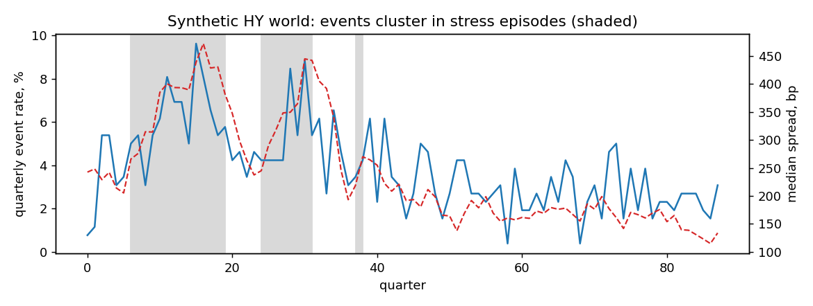

# NLP Credit Early-Warning — a falsifiable pipeline on synthetic worlds

Text-based early-warning models for high-yield credit have a validation
problem: on real data you can never distinguish *"the pipeline found a real
lead in disclosure language"* from *"the pipeline laundered information that
was already in the spread"*. Both produce the same backtest.

This project inverts the problem. It builds a synthetic HY credit world where
the ground truth is known by construction, then instantiates **three variants
that share bit-identical dynamics** — same latent credit states, same
defaults, same spreads, same fundamentals, same random draws — and differ in
exactly one place: what the management-report text contains.

| world | what the text encodes | text should predict events? | text should add to the spread? |
|---|---|---|---|
| `signal` | the issuer's latent state **plus a pipeline shock management sees ~2 quarters before it lands in the numbers** | yes | **yes** |
| `coincident` | the market's own information set (text echoes the price) | yes | **no** — the tautology trap |
| `noise` | nothing (independent noise) | no | no |

A pipeline run unchanged on all three worlds is *falsifiable*: it must find
the incremental signal where it exists, and — just as important — must find
nothing where there is nothing. A pipeline that "finds" signal in the
`coincident` or `noise` world has leakage or is overfitting, full stop.

## Results

Discrete-time hazard (logistic), 4-quarter event horizon, expanding
walk-forward with purging and a 4-quarter embargo, 3 seeds per world
(~260 issuers × 88 quarters each, ~500 events per run). ΔAUC is the
increment of adding text features to the market+fundamentals baseline;
the CI is a block bootstrap resampling **quarters**, not rows (events
arrive in waves; row bootstrap would fake independence).

| world | AUC text-only | AUC mkt+fund | AUC full | ΔAUC text (5–95% CI) | ΔAUC kitchen-sink | P@15 base → full |
|---|---|---|---|---|---|---|
| signal | 0.797 | 0.845 | 0.852 | **+0.007 (+0.005, +0.009)** | +0.004 | 0.449 → 0.457 |
| coincident | 0.719 | 0.845 | 0.845 | −0.000 (−0.001, +0.000) | −0.003 | 0.449 → 0.448 |
| noise | 0.511 | 0.845 | 0.845 | −0.000 (−0.001, +0.000) | −0.003 | 0.449 → 0.452 |

Three readings, in decreasing order of comfort:

1. **The falsification holds.** Identical baseline AUC across worlds (0.845)
   confirms the worlds share dynamics. The increment appears only in
   `signal`, with a CI that excludes zero, and survives the out-of-cycle
   holdout (train strictly before the largest stress episode, test inside
   it: ΔAUC positive in 3/3 seeds).
2. **The tautology trap, demonstrated.** In the `coincident` world text
   *alone* scores AUC 0.72 — a naive study would celebrate — and adds
   exactly nothing given the spread. Disclosure language that merely
   reflects what the market already knows is true and useless.
3. **The honest magnitude is small.** +0.007 AUC, +0.8pp on a 15-name
   watchlist — in a world *designed* to contain a real lead and with a
   clean extractor. Treat any real-data claim of tone adding +0.05 AUC
   over the spread with the suspicion it deserves.

The **kitchen-sink column** is the fourth lesson: adding four plausible-
sounding but noisy features (boilerplate length and its delta, YoY cosine
similarity, its missingness flag) to the same model *halves* the real
increment in `signal` and turns it negative elsewhere. Feature discipline is
not aesthetics; it is where small signals go to die.



## The world, briefly

`synthcredit/world.py` simulates a quarterly panel: a two-state aggregate
cycle (calm/stress, Markov), a mean-reverting latent distress `x` per issuer
with cycle loadings and quality heterogeneity, a hazard
`P(event) = σ(a + b·x)`, exits on event and fresh entrants (no survivorship
by construction), spreads that price a noisy contemporaneous view of `x`,
sticky ratings (EMA filter), fundamentals reported with a 1–2 quarter
publication lag.

The one economically load-bearing choice: the **pipeline component**. Each
issuer carries a persistent AR(1) stream (order book, lost contracts) that
lands in `x` with a two-quarter delay. In the `signal` world, management
observes it and it tilts the language of the current filing. Two quarters
matter because **the publication lag eats exactly one**: a one-quarter lead
would be fully priced by the time the filing is readable — verified
numerically during design, where even an oracle reading a one-quarter iid
lead added ≈ +0.005 AUC. Persistence is what makes early knowledge worth
anything over a multi-quarter horizon.

`synthcredit/documents.py` renders each filing from sentence pools whose
hedged/confident mix follows the management signal, with two deliberate
traps: RISK FACTORS boilerplate that grows append-only with age and cycle
(for everyone — length is lawyer time, not issuer fate), and a liquidity
detail block whose *omission* is informative (coverage degradation).

`synthcredit/features.py` reads only the rendered text: a small illustrative
Loughran–McDonald-style lexicon scored **on management-authored sections
only**, deltas filing-over-filing, YoY cosine similarity, coverage flags —
then a point-in-time as-of join. Every model-matrix row carries `max_pub_q`,
the latest publication quarter that touched it.

## Anti-leakage, as tested invariants

Promises about point-in-time discipline are worthless; tests are not.
`tests/` asserts, among other things:

* `max_pub_q ≤ quarter` for every row of the model matrix;
* **truncation invariance**: recomputing the entire pipeline on data
  censored at time T leaves every row with as-of ≤ T−h bit-identical —
  if any feature peeks past its publication date, this fails;
* walk-forward folds respect the embargo (`test.quarter ≥ cutoff + h`) and
  training labels are fully resolved before the cutoff;
* the three worlds share identical states, events and prices, and differ
  only in the text channel;
* the falsification pattern itself (signal > coincident ≈ noise ≈ 0) on a
  reduced configuration.

Run them with `pytest tests/` or, without pytest, `python run_tests.py`.

## Reproduce

```bash
pip install -r requirements.txt
python run_experiment.py                 # 3 worlds × 3 seeds, ~5 min
python run_experiment.py --fast          # smoke run, ~1 min
python run_experiment.py --model hgb     # gradient-boosting robustness
python run_experiment.py --figure        # regenerate docs/world_overview.png
```

Outputs land in `outputs/` (`results.md`, `results_raw.csv`). Everything is
seeded; the table above is `python run_experiment.py --seeds 3`.

## What this does and does not show

It shows that a disciplined pipeline — PIT joins, purged walk-forward,
quarter-block bootstrap, out-of-cycle holdout — can *detect a small genuine
text lead without hallucinating one where none exists*, and it makes the
tautology failure mode concrete and measurable.

It does **not** show that real HY filings contain such a lead. The signal
magnitude here is a design parameter, not an empirical estimate. Real
documents add problems this sandbox deliberately lacks: mixed languages,
OCR noise, lawyer-templated prose shared across issuers, LLM scorers whose
training data post-dates the filings (lookahead through the model weights),
and — irreducibly — the small number of independent credit cycles in any
realistic sample, which caps how much any backtest, however clean, can
prove. The three-world design is the part that transfers: before believing a
text signal on real data, know what your pipeline reports when fed text that
provably contains nothing.

## References

* Shumway (2001), *Forecasting bankruptcy more accurately: a simple hazard
  model* — the discrete-time hazard framing.
* Loughran & McDonald (2011), *When is a liability not a liability?* —
  finance-specific tone lexica; the lexicon here is a small illustrative
  stand-in, not the licensed LM dictionary.
* Cohen, Malloy & Nguyen (2020), *Lazy Prices* — changes in disclosure
  language, not levels, carry the information.
